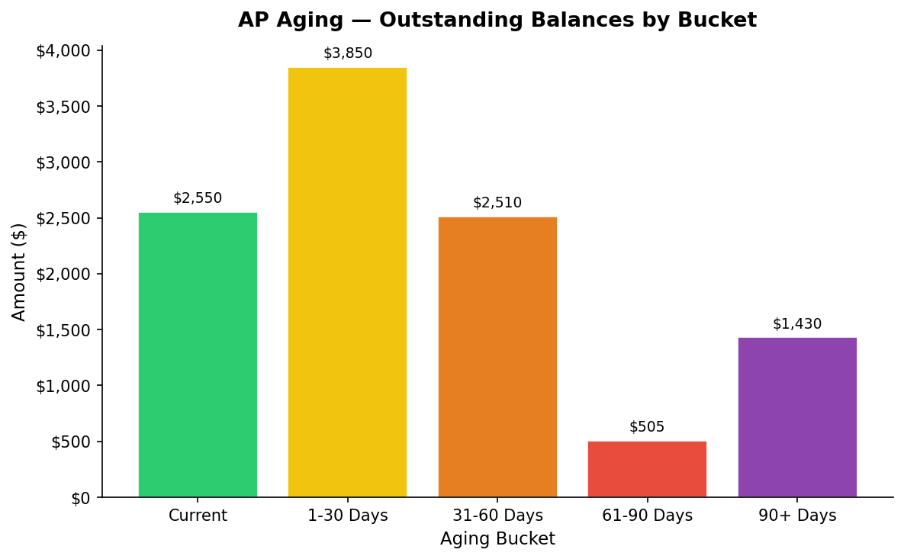

# Accounts Payable Aging Report
**As of:** February 01, 2024  
**Prepared:** 2026-03-17  
**Status:** ✅ Demonstration — Synthetic Data Only

---

## Summary by Aging Bucket

| Aging Bucket   |   # Invoices | Total Owing ($)   |
|:---------------|-------------:|:------------------|
| Current        |            6 | $2,550.45         |
| 1-30 Days      |            3 | $3,850.00         |
| 31-60 Days     |            3 | $2,510.00         |
| 61-90 Days     |            2 | $505.00           |
| 90+ Days       |            1 | $1,430.00         |

**Total AP Outstanding: $10,845.45**

---

## Invoice Detail

| invoice_id   | vendor                     | invoice_date   | due_date   | amount    |   days_overdue | aging_bucket   |
|:-------------|:---------------------------|:---------------|:-----------|:----------|---------------:|:---------------|
| INV-001      | Office Depot Canada        | 2024-01-05     | 2024-02-04 | $320.45   |             -3 | Current        |
| INV-002      | Staples Business Advantage | 2023-12-01     | 2023-12-31 | $875.00   |             32 | 31-60 Days     |
| INV-003      | Canon Canada Inc.          | 2023-11-15     | 2023-12-15 | $1,250.00 |             48 | 31-60 Days     |
| INV-004      | Pitney Bowes Canada        | 2024-01-10     | 2024-02-09 | $430.00   |             -8 | Current        |
| INV-005      | Shred-it Canada            | 2023-10-20     | 2023-11-19 | $215.00   |             74 | 61-90 Days     |
| INV-006      | Ricoh Canada Inc.          | 2023-12-20     | 2024-01-19 | $980.00   |             13 | 1-30 Days      |
| INV-007      | Iron Mountain Canada       | 2024-01-15     | 2024-02-14 | $560.00   |            -13 | Current        |
| INV-008      | Bell Business Solutions    | 2023-09-01     | 2023-10-01 | $1,430.00 |            123 | 90+ Days       |
| INV-009      | Rogers Business            | 2023-12-10     | 2024-01-09 | $770.00   |             23 | 1-30 Days      |
| INV-010      | Canada Post                | 2024-01-20     | 2024-02-19 | $145.00   |            -18 | Current        |
| INV-011      | FedEx Canada               | 2023-11-25     | 2023-12-25 | $385.00   |             38 | 31-60 Days     |
| INV-012      | Purolator                  | 2023-10-15     | 2023-11-14 | $290.00   |             79 | 61-90 Days     |
| INV-013      | Cintas Canada              | 2024-01-08     | 2024-02-07 | $620.00   |             -6 | Current        |
| INV-014      | Sysco Canada               | 2023-12-05     | 2024-01-04 | $2,100.00 |             28 | 1-30 Days      |
| INV-015      | Amazon Business Canada     | 2024-01-18     | 2024-02-17 | $475.00   |            -16 | Current        |

---

> **Note:** This report uses synthetic (fictional) data for portfolio demonstration purposes.
