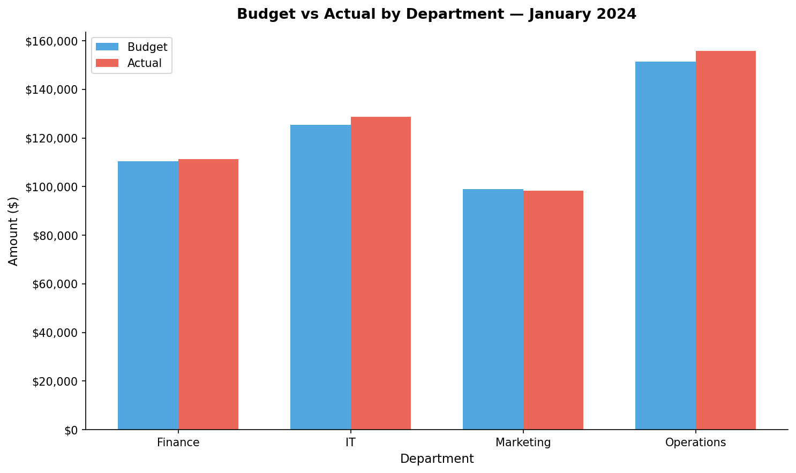

# Budget vs Actual Variance Report
**Period:** January 2024  
**Prepared:** 2026-03-17  
**Variance Flag Threshold:** ±10%  
**Status:** ✅ Demonstration — Synthetic Data Only

---

## Executive Summary

Total company spend came in **$7,770.00 (1.6%)** **over budget** for January 2024.

| | Budget | Actual | Variance | Variance % |
| --- | ---: | ---: | ---: | ---: |
| **Total** | **$486,450.00** | **$494,220.00** | **$+7,770.00** | **+1.6%** |

---

## Department Summary

| department   | budget      | actual      | variance   | variance_pct   |
|:-------------|:------------|:------------|:-----------|:---------------|
| Finance      | $110,450.00 | $111,250.00 | $800.00    | +0.7%          |
| IT           | $125,500.00 | $128,800.00 | $3,300.00  | +2.6%          |
| Marketing    | $99,000.00  | $98,300.00  | $-700.00   | -0.7%          |
| Operations   | $151,500.00 | $155,870.00 | $4,370.00  | +2.9%          |

---

## Top 5 Variance Drivers

| department   | category             | budget      | actual      | variance   | variance_pct   |
|:-------------|:---------------------|:------------|:------------|:-----------|:---------------|
| Operations   | Salaries & Wages     | $120,000.00 | $124,500.00 | $4,500.00  | +3.8%          |
| Marketing    | Digital Advertising  | $15,000.00  | $18,500.00  | $3,500.00  | +23.3%         |
| Marketing    | Events & Sponsorship | $10,000.00  | $7,500.00   | $-2,500.00 | -25.0%         |
| IT           | Hardware & Equipment | $12,000.00  | $14,300.00  | $2,300.00  | +19.2%         |
| Marketing    | Salaries & Wages     | $65,000.00  | $63,000.00  | $-2,000.00 | -3.1%          |

---

## Full Variance Detail
> ⚠️ = variance exceeds ±10%

| department   | category                 | budget      | actual      | variance   | variance_pct   | Flag   |
|:-------------|:-------------------------|:------------|:------------|:-----------|:---------------|:-------|
| Operations   | Salaries & Wages         | $120,000.00 | $124,500.00 | $4,500.00  | +3.8%          |        |
| Operations   | Benefits & Payroll Taxes | $18,000.00  | $19,200.00  | $1,200.00  | +6.7%          |        |
| Operations   | Office Supplies          | $4,500.00   | $5,120.00   | $620.00    | +13.8%         | ⚠️     |
| Operations   | Software & Subscriptions | $6,000.00   | $5,800.00   | $-200.00   | -3.3%          |        |
| Operations   | Travel & Entertainment   | $3,000.00   | $1,250.00   | $-1,750.00 | -58.3%         | ⚠️     |
| Finance      | Salaries & Wages         | $85,000.00  | $85,000.00  | $0.00      | +0.0%          |        |
| Finance      | Benefits & Payroll Taxes | $12,750.00  | $13,000.00  | $250.00    | +2.0%          |        |
| Finance      | Professional Fees        | $8,000.00   | $9,500.00   | $1,500.00  | +18.8%         | ⚠️     |
| Finance      | Training & Development   | $3,500.00   | $2,800.00   | $-700.00   | -20.0%         | ⚠️     |
| Finance      | Office Supplies          | $1,200.00   | $950.00     | $-250.00   | -20.8%         | ⚠️     |
| Marketing    | Salaries & Wages         | $65,000.00  | $63,000.00  | $-2,000.00 | -3.1%          |        |
| Marketing    | Digital Advertising      | $15,000.00  | $18,500.00  | $3,500.00  | +23.3%         | ⚠️     |
| Marketing    | Events & Sponsorship     | $10,000.00  | $7,500.00   | $-2,500.00 | -25.0%         | ⚠️     |
| Marketing    | Creative & Design        | $5,000.00   | $6,200.00   | $1,200.00  | +24.0%         | ⚠️     |
| Marketing    | Travel & Entertainment   | $4,000.00   | $3,100.00   | $-900.00   | -22.5%         | ⚠️     |
| IT           | Salaries & Wages         | $95,000.00  | $95,000.00  | $0.00      | +0.0%          |        |
| IT           | Hardware & Equipment     | $12,000.00  | $14,300.00  | $2,300.00  | +19.2%         | ⚠️     |
| IT           | Software Licenses        | $8,500.00   | $8,500.00   | $0.00      | +0.0%          |        |
| IT           | Cloud & Hosting          | $6,000.00   | $7,200.00   | $1,200.00  | +20.0%         | ⚠️     |
| IT           | Maintenance & Support    | $4,000.00   | $3,800.00   | $-200.00   | -5.0%          |        |

---

> **Note:** This report uses synthetic (fictional) data for portfolio demonstration purposes.
