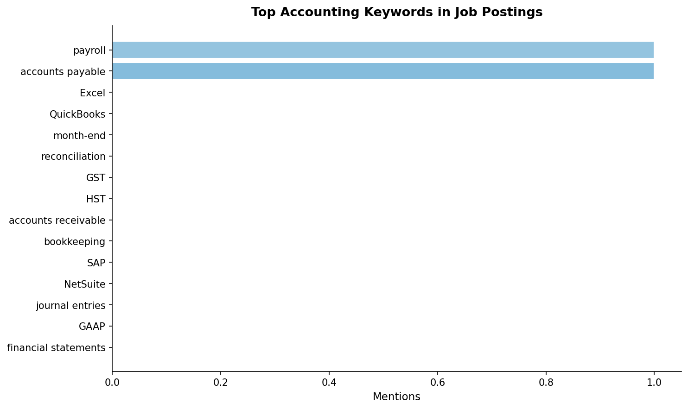
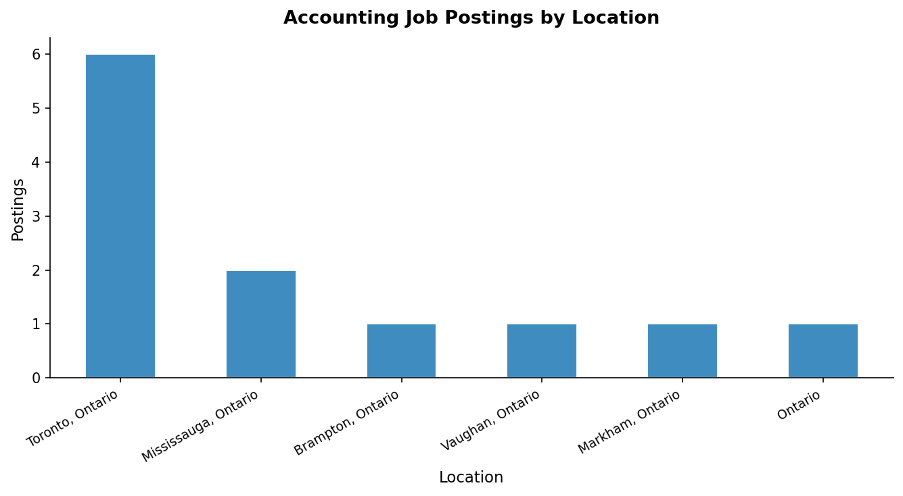

# Accounting Job Market Summary
**Scope:** Entry-level & Intermediate Accounting Roles — Toronto / Ontario / Canada  
**Report Date:** 2026-03-17  
**Total Postings Analyzed:** 12

---

## Postings by Location

| Location             |   Postings |
|:---------------------|-----------:|
| Toronto, Ontario     |          6 |
| Mississauga, Ontario |          2 |
| Brampton, Ontario    |          1 |
| Vaughan, Ontario     |          1 |
| Markham, Ontario     |          1 |
| Ontario              |          1 |

---

## Postings by Role Category

| Role Category        |   Count |
|:---------------------|--------:|
| Other Accounting     |       5 |
| Accounting Assistant |       3 |
| AP / AR Clerk        |       3 |
| Junior Accountant    |       2 |
| Bookkeeper           |       2 |
| Payroll              |       1 |
| Financial Analyst    |       1 |

---

## Top Accounting Keywords / Skills in Postings

| Keyword / Skill      |   Mentions |
|:---------------------|-----------:|
| payroll              |          1 |
| accounts payable     |          1 |
| Excel                |          0 |
| QuickBooks           |          0 |
| month-end            |          0 |
| reconciliation       |          0 |
| GST                  |          0 |
| HST                  |          0 |
| accounts receivable  |          0 |
| bookkeeping          |          0 |
| SAP                  |          0 |
| NetSuite             |          0 |
| journal entries      |          0 |
| GAAP                 |          0 |
| financial statements |          0 |

---

## Charts

---

## Key Takeaways

- **6** postings in the Toronto area.
- Most in-demand skills: **Excel, QuickBooks, reconciliation, month-end close**.
- Target roles align with entry/intermediate accounting track: AP/AR, Junior Accountant, Bookkeeper.
- Ontario/Canada postings confirm strong demand for accounting support staff.

> Data sourced from scraped job postings filtered for entry/intermediate seniority.
> Synthetic sample used when no live CSV is present.
